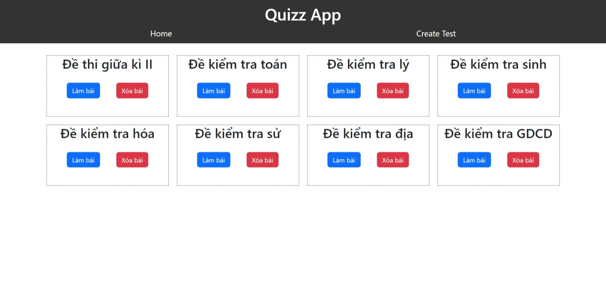
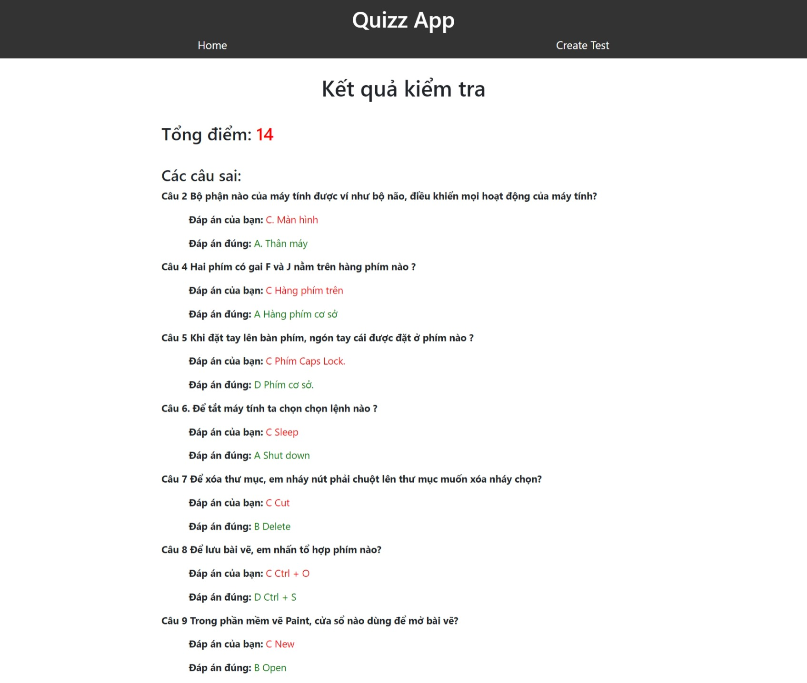
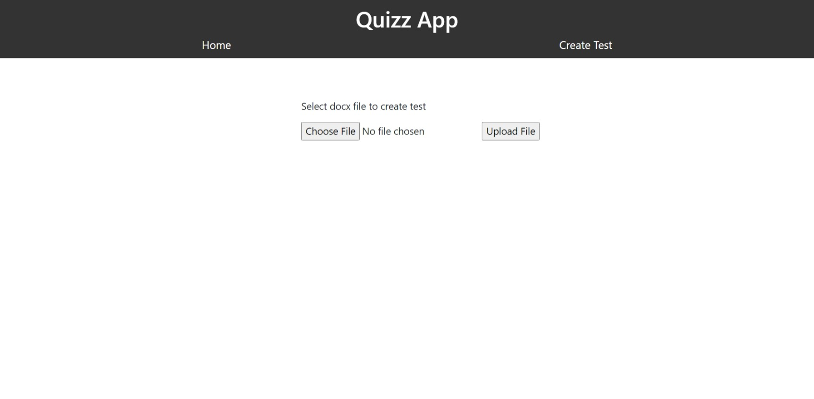

# Project CNPMNC

## Project name: Quizz App

#

## Members:

- ## Nguyễn Ngọc Phương Quỳnh
- ## Huỳnh Thị Thanh Ngân
- ## Phạm Như Ý

## Setup Postgres Database

- ## Install Postgres

```bash
$ winget install -e --id PostgreSQL.PostgreSQL
```

- ### User default: `postgres`
- ### Password default: `postgres`

* ## Create database

* ### Step 1: open SQL Shell (psql)
* ### Step 2: `$ create database quizz;`

## Setup Backend

- ### Step 1: `$ cd backend`
- ### Step 2: `$ pip install -r requirements.txt`
- ### Step 3: Follow link [backend\app\database\Database.py](backend\app\database\Database.py) to update user, password of your postgresql
- ### Step 4: `$ python main.py`
- ### Step 5: Follow link [http://localhost:8000/docs](http://localhost:8000/docs) to view API docs in your browser

#

## Setup Frontend

- ### Step 1: `$ npm i`
- ### Step 2: `$ npm start`
- ### Step 3: Follow link [http://localhost:3000](http://localhost:3000) to view it in your browser

#

## Demo

### Home page



### Test page


### Result page



### Create test page


